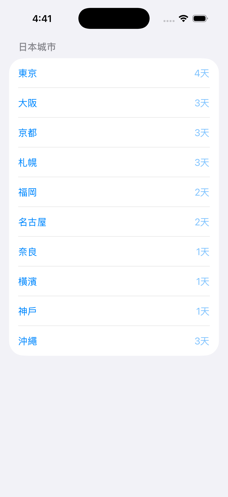
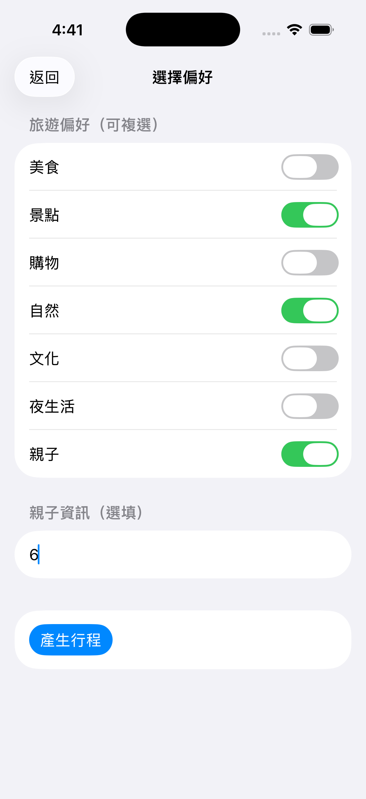
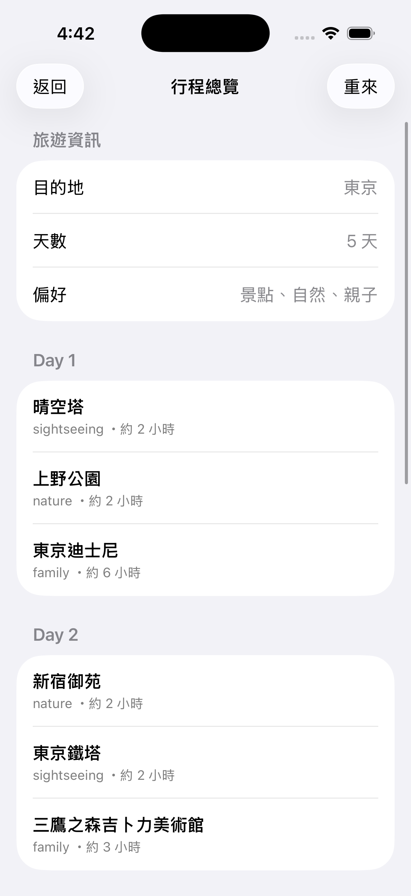

# TripCraft

一個使用 SwiftUI 開發的 iOS 應用程式，幫助您輕鬆規劃日本旅遊行程。

## 畫面預覽






## 功能特色

- 🗾 **多城市支援**：涵蓋日本 10 個主要旅遊城市
- 📅 **彈性天數**：根據目的地提供建議天數，也可自訂
- 🎯 **個人化偏好**：可選擇多種旅遊偏好（美食、景點、購物、自然、文化、夜生活、親子）
- 📋 **智能行程生成**：根據您的選擇自動生成每日行程
- 👨‍👩‍👧‍👦 **親子友善**：支援親子旅遊模式，可設定兒童年齡

## 支援的城市

- 東京（建議 4 天）
- 大阪（建議 3 天）
- 京都（建議 3 天）
- 札幌（建議 3 天）
- 福岡（建議 2 天）
- 名古屋（建議 2 天）
- 奈良（建議 1 天）
- 橫濱（建議 1 天）
- 神戶（建議 1 天）
- 沖繩（建議 3 天）

## 使用流程

1. **選擇目的地**：從支援的城市中選擇您想前往的地點
2. **選擇天數**：設定旅遊天數（系統會根據城市提供建議）
3. **選擇偏好**：勾選您的旅遊偏好（可多選）
4. **生成行程**：系統根據您的選擇自動生成行程草稿
5. **檢視行程**：查看完整的每日行程安排

## 技術架構

### 架構模式

- **Coordinator 模式**：使用 `TripCoordinator` 管理整個旅遊規劃流程
- **協議導向設計**：行程生成使用 `ItineraryGenerating` 協議，易於替換和測試
- **MVVM 風格**：清晰的資料模型與視圖分離

### 專案結構

```
TripCraft/
├── Domain/
│   ├── Models/          # 資料模型
│   │   ├── City.swift
│   │   ├── Itinerary.swift
│   │   ├── Place.swift
│   │   └── Preference.swift
│   └── Services/        # 業務邏輯服務
│       ├── ItineraryGenerating.swift
│       ├── PlaceDatabase.swift
│       └── SimpleItineraryGenerator.swift
├── TripFlow/            # 旅遊規劃流程
│   ├── TripCoordinator.swift
│   ├── TripDraft.swift
│   ├── TripFlowRootView.swift
│   ├── TripStep.swift
│   └── Views/           # 各步驟的視圖
│       ├── BuildDraftView.swift
│       ├── PickDaysView.swift
│       ├── PickDestinationView.swift
│       ├── PickPreferencesView.swift
│       └── ReviewItineraryView.swift
└── TripCraftApp.swift   # 應用程式入口
```


## 開發說明

### 核心概念

- **TripStep**：定義整個旅遊規劃流程的步驟狀態
- **TripCoordinator**：管理流程狀態轉換和資料傳遞
- **ItineraryGenerating**：行程生成協議，可實作不同的生成策略
- **PlaceDatabase**：景點資料庫，提供各城市的景點資料

### 擴展性

- 新增城市：在 `City` enum 中新增案例
- 新增偏好：在 `Preference` enum 中新增案例
- 替換生成器：實作 `ItineraryGenerating` 協議並替換 `SimpleItineraryGenerator`

## 授權

此專案為個人專案，僅供學習與參考使用。

## 作者

Created by kai on 2025/12/29.
